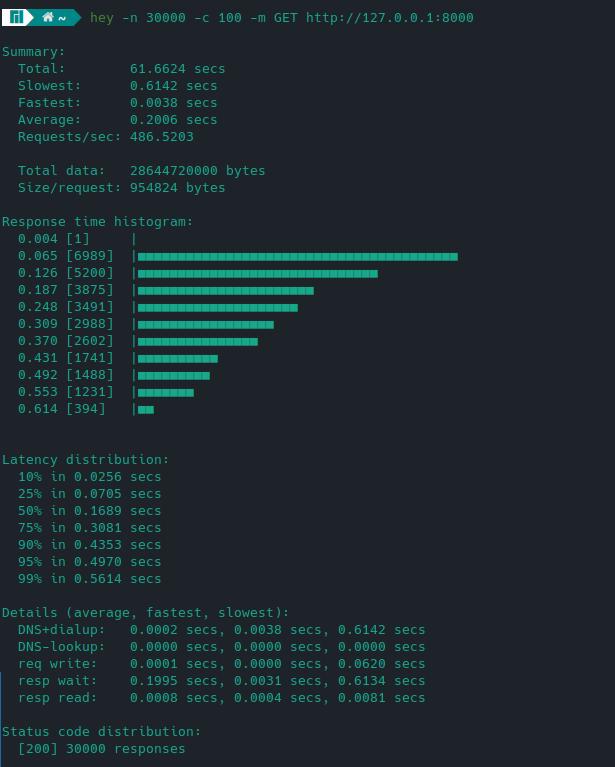

Web server test suite
=====================

Implement a Web server
The implementation uses a module from the Python standard library <i>multiprocessing</i>. 
In multiprocessing, processes are spawned by creating a Process object and then calling its `start()` method. 
The server can be started with the following options:

| Key            | Description                                       |
|----------------|---------------------------------------------------|
| --workers/-w   | number of workers (default 3)                     |
| --root_path/-r | DOCUMENT_ROOT (default current directory)         |
| --logfile      | log file name (standard output stream by default) |
| -X             | enable debug mode                                 |

## Requirements ##

* Respond to `GET` with status code in `{200,404}`
* Respond to `HEAD` with status code in `{200,404}`
* Respond to all other request methods with status code `405`
* Directory index file name `index.html`
* Respond to requests for `/<file>.html` with the contents of `DOCUMENT_ROOT/<file>.html`
* Requests for `/<directory>/` should be interpreted as requests for `DOCUMENT_ROOT/<directory>/index.html`
* Respond with the following header fields for all requests:
  * `Server`
  * `Date`
  * `Connection`
* Respond with the following additional header fields for all `200` responses to `GET` and `HEAD` requests:
  * `Content-Length`
  * `Content-Type`
* Respond with correct `Content-Type` for `.html, jpg, .jpeg, .png, .gif`

## Testing ##
* `httptest` folder from `http-test-suite` repository should be copied into `DOCUMENT_ROOT`
* Lowest-latency response (tested using `hey`, similar ApacheBench on ArchLinux) in the following command: 
<pre>hey -n 30000 -c 100 -m GET http://localhost:8000</pre>
#### _**Test result on screenshot below**_

